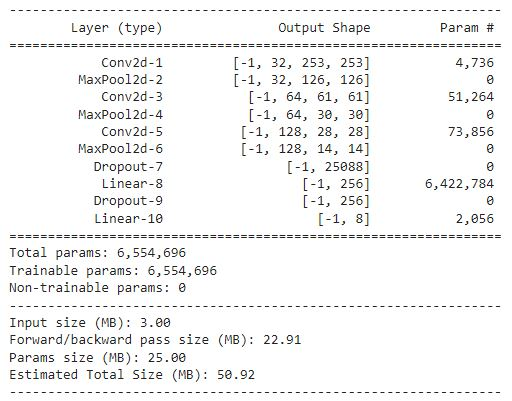

## Glue Tube Length Prediction Using KeyPoint Detection
[](https://drive.google.com/file/d/1z5imf5AMa3Fq0oEYX4L6Tt3H051gDube/view?usp=sharing)

This project attempts to predict glue tube length from keypoint detection of tube head and tail.
As most of the images have two tubes present in the image, used model has **eight(8)** nodes in the logit layer.
A simple data imputation was used to avert input error while training by inserting ```(0,0),(0,0)``` co-ordinates
in images having single tube.
### Image Augmentation
The following transformation techniques were used from **Albumentations** library

- **Rescale** to 512 for width and height with application probability of 1.0
- **VerticalFlip** with a application probability of 0.7
- **HorizontalFlip** with a application probability of 0.7
- **HueSaturationValue** with a application probability of 0.5
- **RGBShift** with application probability of 0.7
- **RandomBrightnessContrast** with application probability of 0.5
- **Normalize & Convert ToTensor** with application probability of 1.0

### Architecture

A simple model with:
1. Three (3) **Conv2D** layers
2. **ReLU** Activation and **MaxPooling** in every layer
3. Two (2) **fully-connected** layers, and **Dropout**  to prevent overfitting.


### Hyperparameters
BatchSize, Epochs, Loss & Optimization Functions(using **GPU**)
- **BatchSize** : 8 
- **Epochs**   : 100 (can train longer for better performance)
- **Loss**     : Mean squared error (MSE)
- **Optimizer** : Adam 
- **Learning Rate**: 0.0001

### Results:
After training the model for 100 epochs we got the following results:
1. train_loss:0.0921
2. val_loss: 0.0926
3. test_loss: 0.05484

### Files in Order
- models.py
- dataset.py
- pl_modules.py
- augmentations.py
- configs.py
- utils.py
- Notebook Glue_tube_length_by_keypoint_detection.ipynb

### Tensorboard monitoring

you can use tensorboard for monitoring the training. Use the following command after starting training. \
```tensorboard --logdir ./model/logs```
